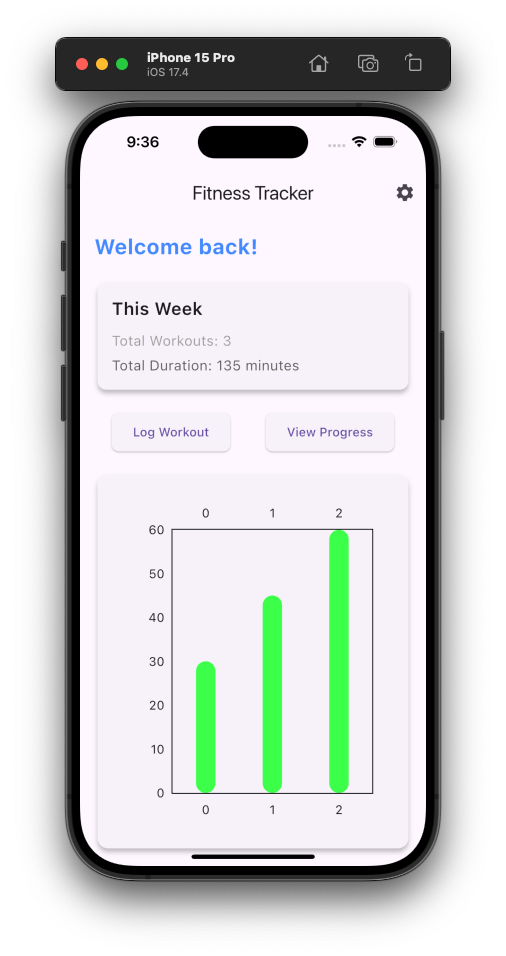
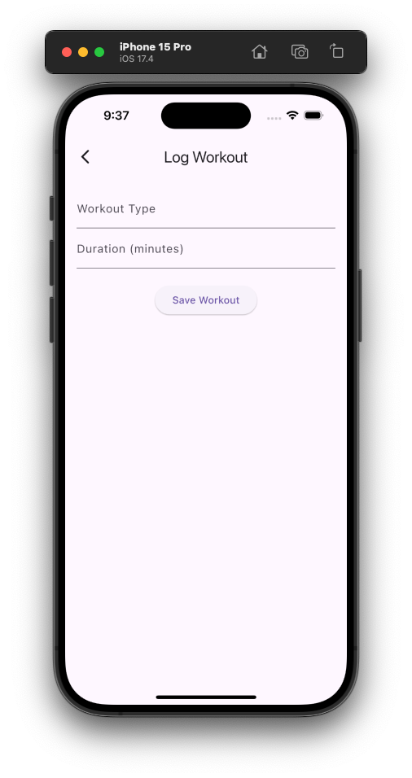
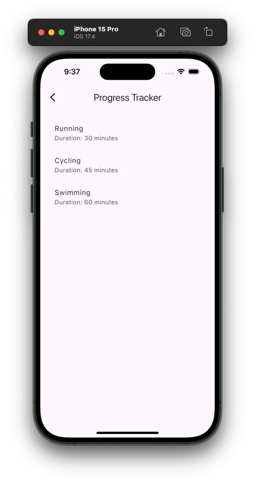
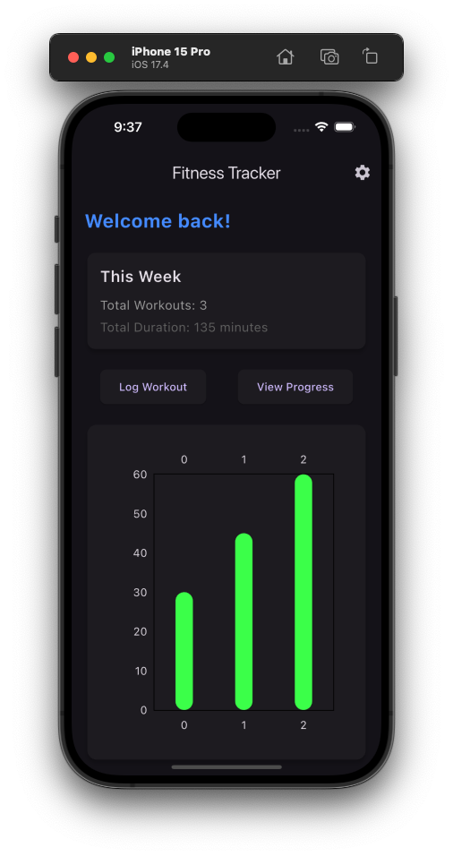
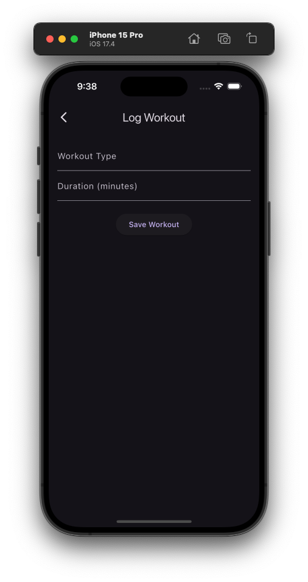
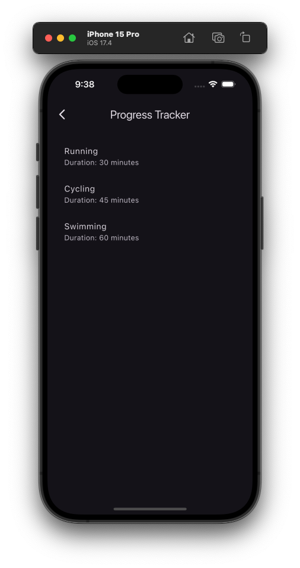

# Fitness Tracker

Welcome to **Fitness Tracker**, a comprehensive Flutter application designed to help you monitor and improve your fitness journey. Whether you're tracking workouts, monitoring progress, or setting new fitness goals, Fitness Tracker has you covered.

## Features

- **Workout Logging**: Easily log your workouts with details like type, duration, and intensity.
- **Progress Tracking**: Visualize your fitness progress over time with detailed charts and statistics.

## Getting Started

### Prerequisites

- Flutter SDK
- Dart SDK

### Installation

1. **Clone the repository**:
    ```bash
    git clone https://github.com/aarontully/fitness_tracker.git
    ```
2. **Install the dependencies**:
    ```bash
    flutter pub get
    ```
3. **Run the app**:
    ```bash
    flutter run
    ```

## Usage

1. **Log Workouts**: Tap the log button to start recording your workout details.
2. **Track Progress**: View your workout history and progress through detailed charts and statistics.

## Screenshots

  

  

## Contributing

We welcome contributions! Please read our Contributing Guidelines for more details.

## License

This project is licensed under the MIT License - see the LICENSE file for details.

## Contact

If you have any questions or feedback, feel free to reach out at your.email@example.com.